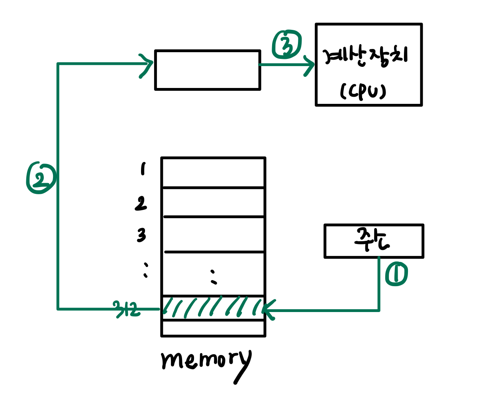
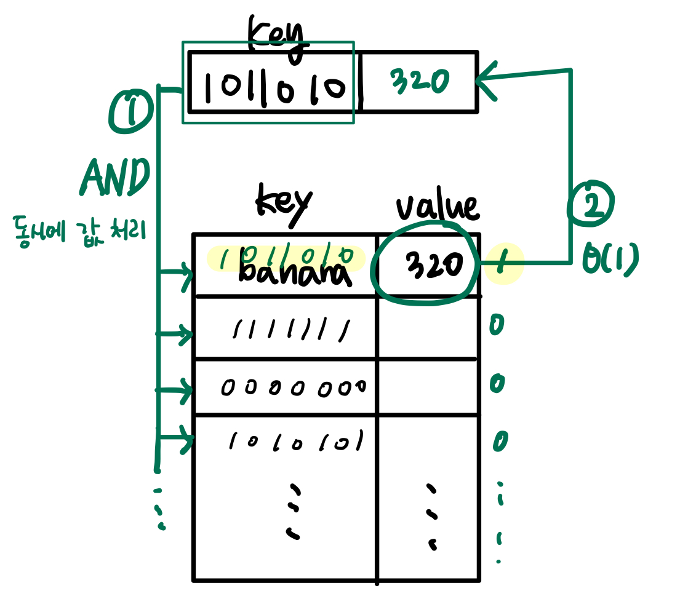
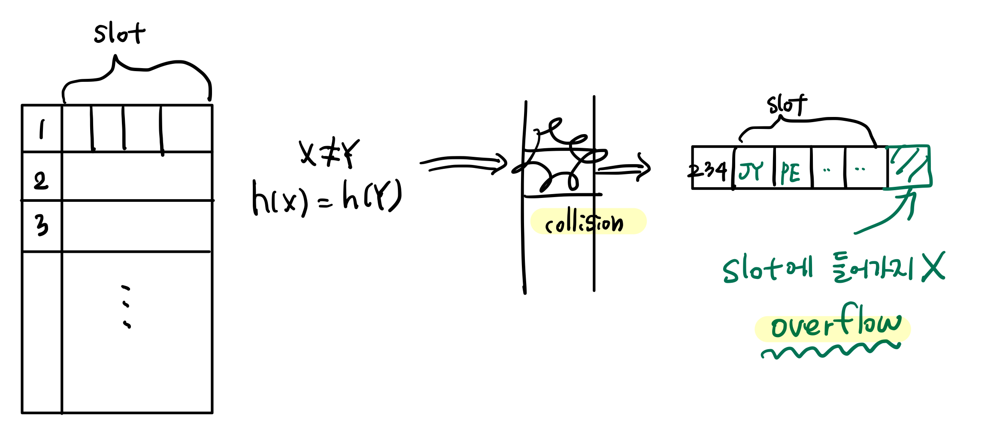
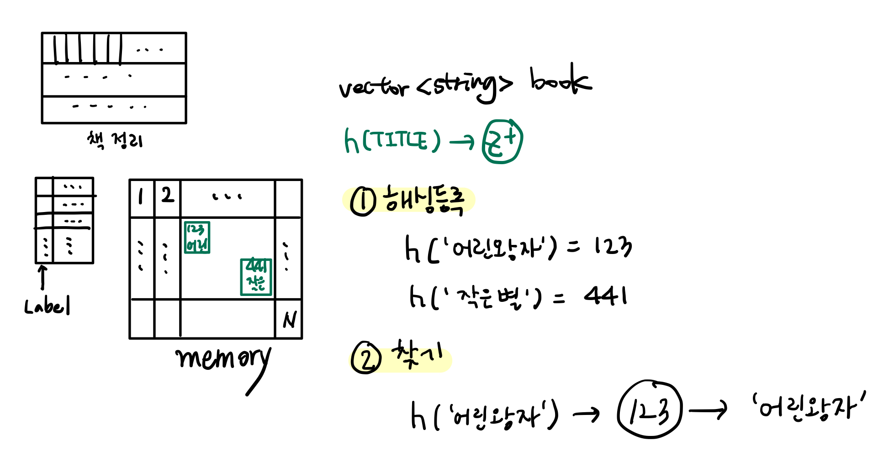
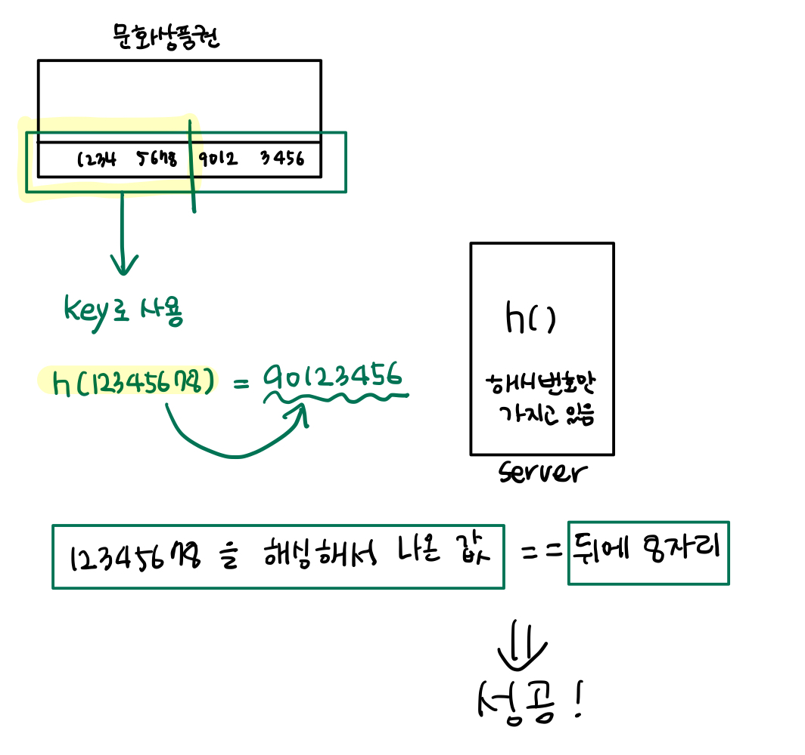
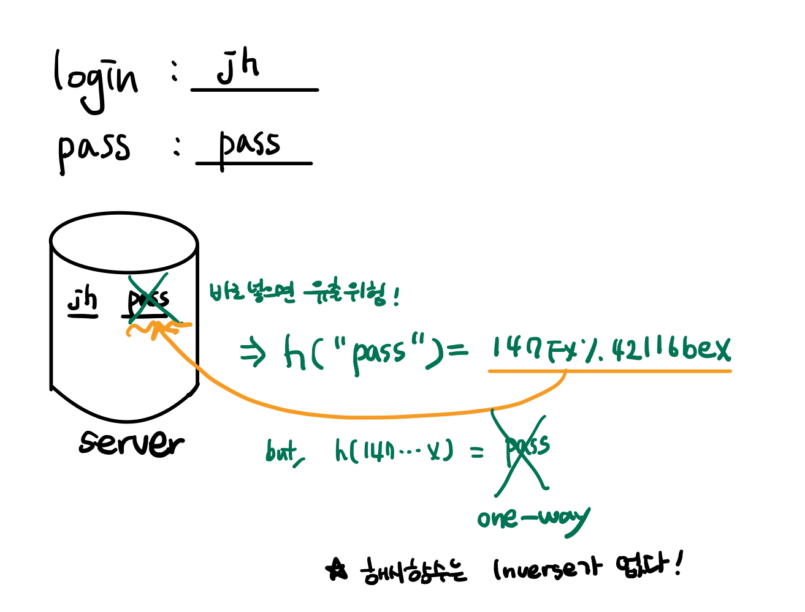
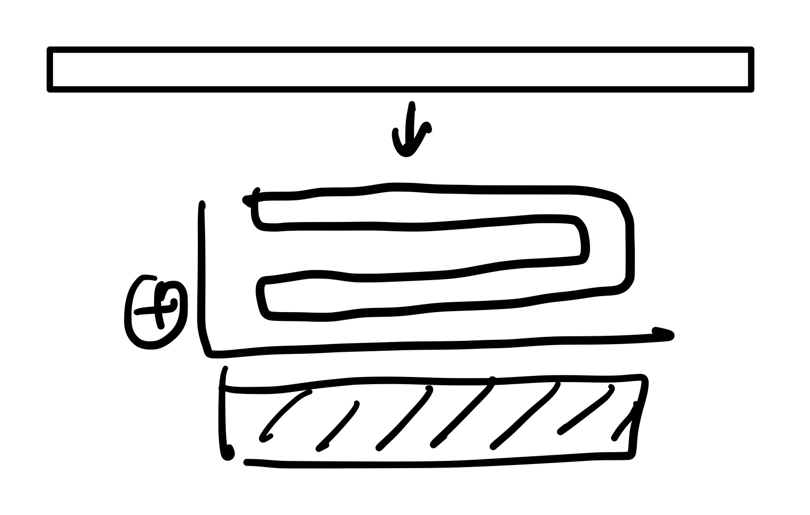

## <span class="highlight">Hashing이란</span>

해싱은 associative memory 구조를 가진 자료구조로, 일반적인 폰 노이만 구조이다.


- **폰 노이만 구조**

  

  만약 '바나나'를 찾으려고 한다면, '바나나'가 아닌 '바나나'(value)가 있는 주소(address)를 찾아야 한다.
  (폼노이만은 key + value 구조로 되어있다)

<br/>

즉, 해싱은 어떤 데이터를 저장공간에 넣어두고, 각 저장공간을 주소(address)로 접근 해가면서 내용을 비교하는 방식이다.
(검색, 저장하는 방법과는 완전히 다르다.)

<br/>

### Associative Memory

1980년 고안되었지만 메모리 비용이 커서 상용화 되지 못했다.



찾으려는 key를 table에서 동시에 값을 처리 (`AND연산`). 
탐색 기능이 없다.

- **장점**

  1. **fast** 빠르다

  2. **short** 코드가 짧다


- **단점**

  1. AND를 다 연결시켜줘야하기 때문에 엄청난 비용이 발생한다.


- ex) Python - `dict`

    : memory를 많이 쓰고, memory control 을 시스템이 해준다. (비용 큼)

    하지만 요즘은 memory가 문제 되지 않기 때문에, hashing의 사용이 늘어났다.

<br/>


### Hashing의 종류

- **정적 해싱(Static Hashing)** : 이미 고정된 크기의 공간이 확보되어 있는 경우 
  <br/>

  - **Hash Table** : b개의 bucket에 저장. 각 버켓(bucket)에는 s개의 slot.

  - **Hash Function** : h(k) => z+

  - **Key density(키의 밀도)** : 공간에 key가 얼마나 차지하고 있는지

  - **Loading factor(적재 밀도)** : a = n/(sb)

  <br/>


- **동적 해싱(Dynamic Hashing)** : 필요에 따라서 공간을 늘려서 사용하는 방법 

  <br/>
  1. Hashing은 function(함수)이다.  hash함수에 X를 넣었을 떄, Z+가 나오도록 매핑하는 것.

  2. Memory Map > Bucket > Slot

  <br/>

  - ex) 학점

    ```cpp
    hash_map <string, int> Grade;
    Grade["JY"] = 98;
    hash("JY") = 274; // 주소는 random
    
    cin >> sname;
    cout << Grade[sname] << endl;
    ```

    - slot

    : 슬롯을 두는 이유는 '중복'이 있을 수 있기 때문이다

    `h("JY") = 234`, `h("PE") = 234` => 주소가 같으면, **충돌(Collision)**이 발생한다.

    따라서 Slot을 두고 슬롯에 값을 넣는다.

    

    
      
    <br/>

  - **용어**

    '**h(x) = h(y)**' 라면,
    <br/>

    - **Synonym(동거자)** : x,y 는 동거자

    - **Collision(충돌)**

    - **Overflow(오버플로)**


  <br/>


### Hashing 예시

1. 책 찾기

  


2. 문화상품권

  


3. 로그인-아이디/패스워드

  

  <br/>


## <span class="highlight">Hashing Function</span>

**Hash Function**은 `h(TITLE) -> z+` 로 매핑해주는 함수


### Hashing Function 종류

- 아주 큰 값을 만든 뒤에 `modulo`를 이용해 그 나머지 취하기

- 중간 제곱 : h(k) = (2k+1)^2  =>  중간 digit 4개

- 접기(folding)함수
  

- 숫자 분석 함수 : digit의 base를 다르게 하기
  (10진법 -> 9진법 => `modulo` 나누기)

### 좋은 Hashing Function은?

- Uniform : hashing결과가 유일할수록

- One-way : 해쉬함수는 Inverse가 없다.

- 계산과정 효율성


### STL에서 제공하는 map function

```cpp
map <int, string> Employees;

Employees[1111] = "Jeong C.";
Employees[2222] = "Hye K.";
Employees[1234] = "Ju Y.";
Employees[5678] = "Yeong Q.";

cout << "Employees[1111]=" << Employees[1111] << endl;
cout << "Map size: " << Employees.size() << endl;
```

<br/>


## Hash에서 중요한 것

1. 좋은 Hash 함수

2. 좋은 overflow 처리 방법


### 다양한 Overflow 처리 방법

Memory의 크기와 속도를 고려해서 선택. (만약 STL의 hash를 쓴다면, 걱정하지 않아도 된다.)

1. **Open addressing**

  : 빈 칸이 나올때까지 다음 주소로 차례차례 건너간다. 빈 칸이 나오면 그곳에 넣는다.

  (단점: 박치기를 많이함..)

2. **chaining**

  : 해당 주소의 메모리 뒤에 List 구조로 엮어서 길게 추가한다.

3. **2차 해싱(rehashing)**

  : 다른 해쉬함수를 적용해서 새로운 위치를 찾아 넣는다. 새로 찾은 위치도 overflow 될 경우(비록 확률은 낮겠지만)
  1 또는 2 방법을 사용한다.


