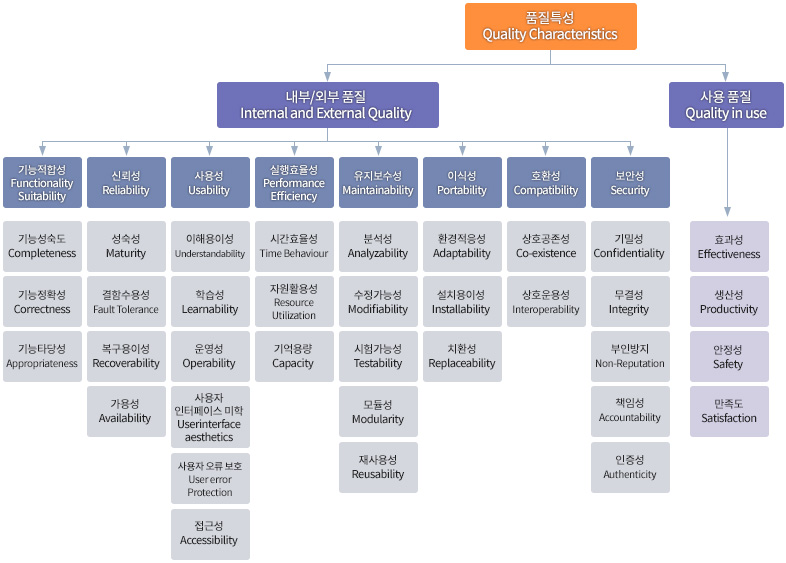

'2022년 동남권 SW 품질 캠프'에서 테스트 방법 및 결과보고서 작성 방법에 대해 약 1시간 정도 강연을 해주셨다.
배운 내용을 기록으로 남겨 공유해보려고 한다.

## 테스팅의 목적

테스팅의 목적은 결함을 발견하고 정식으로 제품을 출시하기 전에 결함을 예방하기 위해서이다.
결함을 제거함에 따른 품질 수준에 대한 자신감 획득도 할 수 있다.

조직 내 제품이나 시스템에 대한 의사결정에 대해
테스팅을 통해 결함이 제거되었기에 제품 출시에 문제가 없고, 언제쯤 가능하다 등의 정보를 제공하기도 한다.

- **테스팅 vs 디버깅**

  테스팅은 동적 테스팅으로 결함에 의한 장애를 보여주는 것, 즉 장애를 통해 결함을 발견하는 것이다. 
  반면 디버깅은 장애(결함)의 원인을 찾고, 분석하여 제거하는 개발 활동이다. 
  역할을 기반으로 테스팅은 테스터가 수행하고 디버깅은 개발자가 수행한다는 점에서도 차이가 있다.

## 테스트의 유형

테스팅의 유형은 목적에 따라 기능 테스트와 비기능 테스트로 나눌 수 있다.

기능 테스트는 시스템이 무엇을 하는 가와 같이 실행 결과 중심이다.
예를 들어 자판기에 동전을 넣고 음료를 선택하면 결과가 나오는 절차를 테스트하는 것과 같다. 
인풋에 대한 아웃풋을 테스트한다고 생각해도 좋을 거 같다.

비기능 테스트는 시스템이 어떻게 동작하는 가와 같이 실행 과정 중심이다.
예를 들어 자판기에 동전을 넣고 음료를 선택해 원하는 음료수가 나오긴 했지만, 그 과정이 30분이 걸렸다면 사용자에게
좋지 않은 경험을 줄 수 있는 것과 같다.

### 기능 테스트

기능 테스트는 정확도, 성숙도 그리고 타당성으로 평가될 수 있다.

1. **기능 정확도**

  얼마나 정확한 결과를 내는지에 대한 정도이다. 
  예를 들어 상품을 검색했을 때 검색한 상품에 맞는 결과를 보여주는지와 같은 정확도를 말한다.

2. **기능 성숙도**

  기능이 사용자의 목적과 맞는지를 보는 것이다. 예를 들어 상품을 골랐는데, 특정 신용카드로만 결제가 된다면 
  다양한 사용자를 고려하지 못한 제품이 될 수 있다. 즉, 결제를 할 수 있다는 점에서 정확도는 있지만
  성숙도가 낮다고 판단할 수 있다.

3. **기능 타당성**

  목적 달성에 쉬운 정도를 검증하는 것이다. 상품 구매 절차를 예로 들자면,
  구매를 위한 기본 정보 제공 외에 추가로 신분증 사진을 찍으라던 가와 같이 타당성이 맞지 않는 요구가 있다고 했을 때
  타당성이 낮은 기능이라고 평가할 수 있다.

### 비기능 테스트

비기능 테스트 같은 경우에는 [ISO/IEC 25010](https://iso25000.com/index.php/en/iso-25000-standards/iso-25010)
표준이 있다. 따라서 ISO/IEC 25010 품질 특성을 기반으로 검증한다.

- **수행 시기**

  전체 테스트 레벨에서 수행할 수 있다.

- **주요 테스트 접근법**

  외부 입력에 대해 소프트웨어의 작동 결과를 검증하는 블랙박스 테스트를 수행하기도 하고 명세를 기반으로 테스트하는 기법도 있다.

- **테스트 종류**

  성능테스트, 부하 테스트, 사용성 테스트, 유지보수성 테스트, 신뢰성 테스트, 이식성 테스트, 현지화 테스팅,
  글로벌화 테스팅 등등이 있다.

### 테스트 접근법

테스팅 접근법으로는 정적인 방법과 동적인 방법이 있다. 이름에서 예상할 수 있듯이 
정적 테스팅은 소프트웨어를 실행하지 않는 테스트 접근법이다. 반대로 동적 테스팅은 소프트웨어를 실행하는
테스트 접근법이다.

## 테스트 방안

아래 그림은 ISO/IEC 25000 SQuaRE(Software Product Quality Requirements and Evaluation) SW
품질평가 통합 모델 중 **ISO/IEC 25010** 품질 특성 모델이다.

### 테스트 프로세스

1. **학습(탐색)**

  제품에 대해 어떤 앱인지 어떤 소프트웨어인지 제품에 대해 이해하는 단계다. 
  소프트웨어를 신중하고 꼼꼼하게 살펴보면서 관찰한다.

2. **전략 수립**

  학습을 바탕으로 테스트 방향을 조정하는 단계다. 테스트 아이디어와 방향을 
  세워본다. 
  
  ex) 다른 비슷한 앱과 비교해 배터리 소모 정도를 본다,
  앱이 중단되는 절차(강제 종료)를 발견하기,
  사용자로서 기대했던 결과가 나오지 않는 경우(휴리스틱) 등

3. **설계**

  다양한 테스트 설계 기법을 이용해 테스트를 설계하는 단계다. 
  구체적인 테스트 케이스를 만든다.

4. **수행**

  주어진 상황에 따라 즉시 테스트를 설계하고 수행하는 단계다. 
  테스트를 실행해보고 결과를 확인한다.

### 테스트 수행 시 생각하면 좋은 것들..

- 세상에 완벽한 시스템, 소프트웨어는 없다는 것이다. 어딘가에 결함이 존재할 거라는 생각으로 찾아보자.

- 비정상적인 사용 패턴, 절차에서 결함이 존재하는 경우가 많다. 기본 시나리오가 아닌 예외 시나리오를 시도해보자!

- 충분한 생각과 시간을 투자했음에도 결함을 발견하지 못했다면, 과감히 다른 영역(기능)에 대한 테스트를 진행하자.
