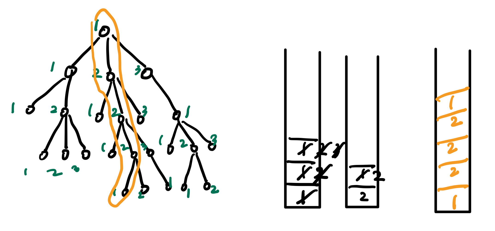
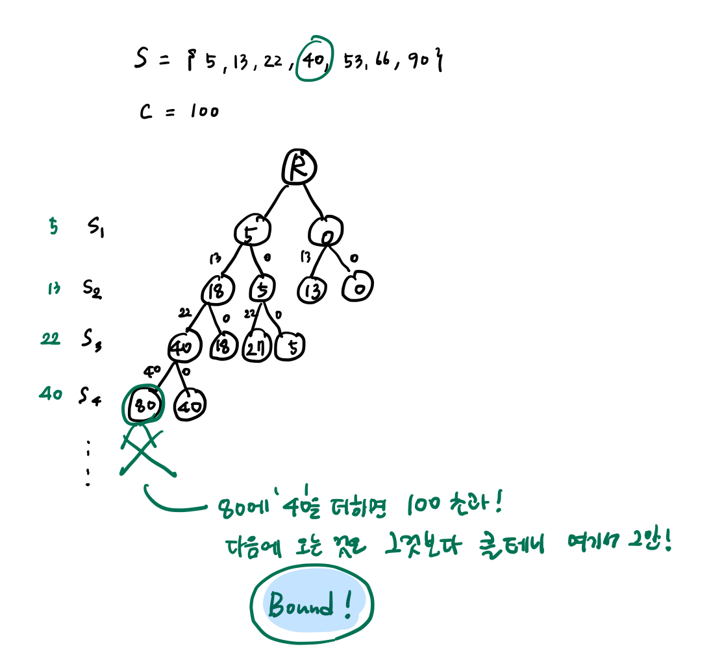

## Search Space

정답을 찾기 위해서 살펴봐야할 범위를 Search Space라고 한다. 이 Search Space의 특성에 따라
알고리즘을 두 가지로 분류할 수 있다.

1. **Exhaustive Searching**
  : 모든 답을 찾아보는 것. 가장 간단한 방법. 답이 있으면 언젠가는 찾는다.

2. **Heuristic Searching**
  : 답이 될 부분을 적절히 골라서 보는 것. 빠르지만 답을 찾지 못할 수 도 있다.

## Backtracking이란

Backtracking은 Exhaustive Searching 방법 중 하나다.

문제 중에는 모든 경우를 탐색해야만 찾을 수 있는 worst case가 있다. 
답을 찾기 위해서 모든 경우를 탐색해야 하기 때문에 효율적이지는 않지만, 
규칙을 통해 체계적으로 해결하는 방법이다. 

즉, 백트래킹(Backtracking)은 강력한 규칙으로 빠짐없이 중복없이 전부 탐색하는 것이다.
ex) 왼쪽 길 먼저 간다!

스스로 정한 규칙을 적용해, 전체를 일렬로 '순서'를 만들어야 한다. 
순서가 있기 때문에 마지막으로 간 곳만 기억하면 된다.

Backtracking이 Depth First Searching이므로 Stack 자료구조를 사용하고,
마지막으로 간 곳만 기억하면 되기 때문에 **"only one stack"**만 있으면 된다!

### Pruning(잘라내기)

만약 답의 '가능성'이 없을 경우, 더 이상 탐색을 하지 않는다.
즉 Bound 값을 설정할 수 있다.
이렇게 지능적으로 Backtracking을 적용하는 방식은 Branch and Bound 방식과 동일하다.