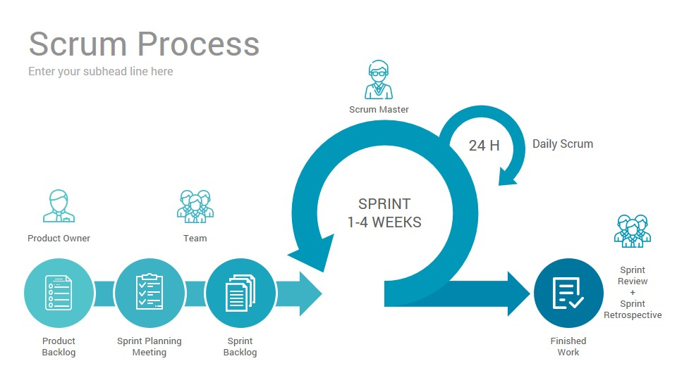

## 프로젝트란

제한된 시간 안에 한정된 자원으로 **'목표하는 일'**을 완수해야 하는 작업

## 애자일(Agile)

> "소프트웨어의 모든 것은 변한다. 요구사항은 변한다. 설계도 변한다.
> 비지니스도 변한다. 기술도 변한다. 팀도 변한다. 팀구성원도 변한다.
> 변화는 반드시 일어나기 때문에, 문제가 되는 것은 변화가 아니다.
> 그보다는 변화를 극복하지 못하는 우리의 무능력이 문제다." _익스트림 프로그래밍

우리가 만들고 있는 것들이 정답이 아닐 수도 있다.
지금 만들고 있는 프로젝트가 시장이 원하는 게 맞을 지, 
또 고객이 원하는 게 맞을 지는 개발 과정에서 정확히 예측하기 힘들다.

따라서 미흡하겠지만 완성된 결과물을 고객이나 시장의 피드백을 통해 수정해가면서 
최종 결과물까지 진행하는 방법인 애자일 사상을 프로젝트에 적용시키곤 한다.
비록 에자일을 계승한 방법을 사용하면 목표에 가까운 결과물을 도출해 낼 순 있겠지만, 
일이 많아질 것이다. 

> 애자일은 사상 또는 철학이다.

애자일을 계승한 방법론 또는 애자일 프레임 워크에는
`스크럼(Scrum)`, `칸반(Kanban)`, `XP(eXtream Programming)`, `LSD(Lean SW Development)`
등이 있다.

### 스크럼(Scrum)

**스프린트(sprint)**: 단기 작업 블록을 통해 프로젝트를 진행하며
스프린트 기간은 보통 2주로 진행한다.
스프린트마다 우선순위를 정해서 중요한 작업부터 처리해 나간다.
(Todo, Doing, Done)

**데일리 스크럼**: 매일 정해진 시간에 정해진 장소에 모여 15분~ 20분 동안 간단하고 빠르게 진행한다.
어제 했던 일과 오늘 할 일, 수행 중 문제점이나 장애요인 등을 공유하며 문제가 있을 경우 미팅 후 바로 해결한다.
일일 스크럼 미팅을 함으로서 프로젝트 후반부에 문제점이 갑자기 발생하는 것을 예방한다.

## 워터폴(Waterfall)

`워터폴(Waterfall)` 은 프로젝트의 순서를 단계별로 순차적으로 진행하는 방법이다.

> 요구 사항 분석 -> 설계 -> 구현 -> 테스트 -> 유지보수

요구사항을 최대한 분석하고, 일정을 수립하고, 개발 기획을 하며,
디자인을 하고, 시장분석도 하는, **"한 사이클로 프로젝트를 완벽하게 완성!"** 을 목표로 한다.

워터폴 방식은 정해진 순서대로 각 파트의 업무가 관리되기 때문에, 
관리가 용이하다는 장점이 있다. 하지만 작업을 순서대로 진행하게 되면, 개발이 완성되기 전까지는 고객이 결과물을 확인을 할 수 없다는 것이 문제가 될 수 있다.

중간에 확인 할 수 없기 때문에, 
디자인 또는 개발이 완성되고 나서 고객이 결과물을 확인했을 때, 만족하지 않는 상황에 대해 대처하기가 힘들다.
이미 많은 단계를 지나왔는데, 다시 이전 단계로 돌아가서 수정하는 건,
일정과 비용 등 큰 손해가 발생할 수 있기 때문이다.

## Agile vs Waterfall

### Waterfall

- 대규모 기능 팀
- 순차적 진행
- 예측에 기반한 계획
- 사전에 정의된 과제 고수(변경 불가)

### Agile

- 소규모 다기능 팀
- 순환적 진행
- 과제의 모듈화, 우선순위화
- 유연하고 지속적인 진화

## 포스트모템(Postmortem)

부검이라고 말하기도 하는, 포스트모템은 프로젝트에 문제가 발생했을 때 이유를 찾아나가는 과정이다.

이 문제를 해결하기 위해서 어떻게 해야할까, **How**를 찾아가는 것인데
이 과정을 진행하기 전, 반드시 전제가 되어야하는 생각이 있다.

바로 문제에 대해 **'Who'** 책임자를 찾는 게 아닌, 이 문제는 누구든지 발생시킬 수 있는 문제였다는 생각을 가지고 
**'How'** 해결에 초점을 맞춰야 한다는 것이다.

### 포스트모템을 위해서

1. **의사 결정 단계마다 정확한 기록이 필요하다**
  : 단계마다 진행했던 다양한 의사결정에 대한 명확한 기록들이 남아있어야, 이를 기반으로 평가가 가능하다.

2. **Who 가 아닌 How를 찾자**

3. **모두 참석해야 한다**
  : 팀원 전체가 모여서 리뷰하면, 놓치는 부분을 최소화 할 수 있다. 그리고 관련 부서도 함께 참여해 같이 리뷰해야
  전체적인 맥락을 더 잘 파악할 수 있고, 여러 관점을 이해할 수 있다.

### reference

- DND, 손현곤님의 '프로젝트 관리 방법론'
- [velog.io/@katanazero86/애자일agile이란-무엇인가](https://velog.io/@katanazero86/%EC%95%A0%EC%9E%90%EC%9D%BCagile%EC%9D%B4%EB%9E%80-%EB%AC%B4%EC%97%87%EC%9D%B8%EA%B0%80)
- [brunch.co.kr/@aykim13/42](https://brunch.co.kr/@aykim13/42)
- [happist.com/562217/정부든-기업이든-포스트모템postmotem에-필요한-이유](https://happist.com/562217/%EC%A0%95%EB%B6%80%EB%93%A0-%EA%B8%B0%EC%97%85%EC%9D%B4%EB%93%A0-%ED%8F%AC%EC%8A%A4%ED%8A%B8%EB%AA%A8%ED%85%9Cpostmotem%EC%97%90-%ED%95%84%EC%9A%94%ED%95%9C-%EC%9D%B4%EC%9C%A0)