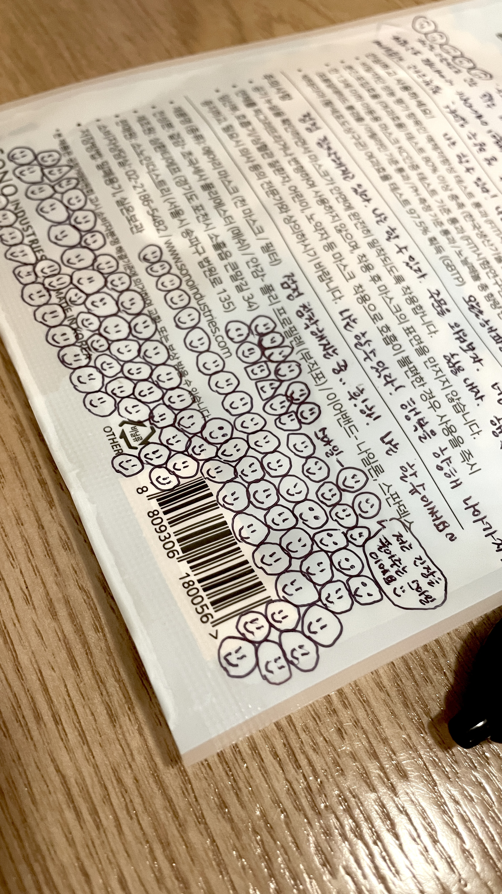
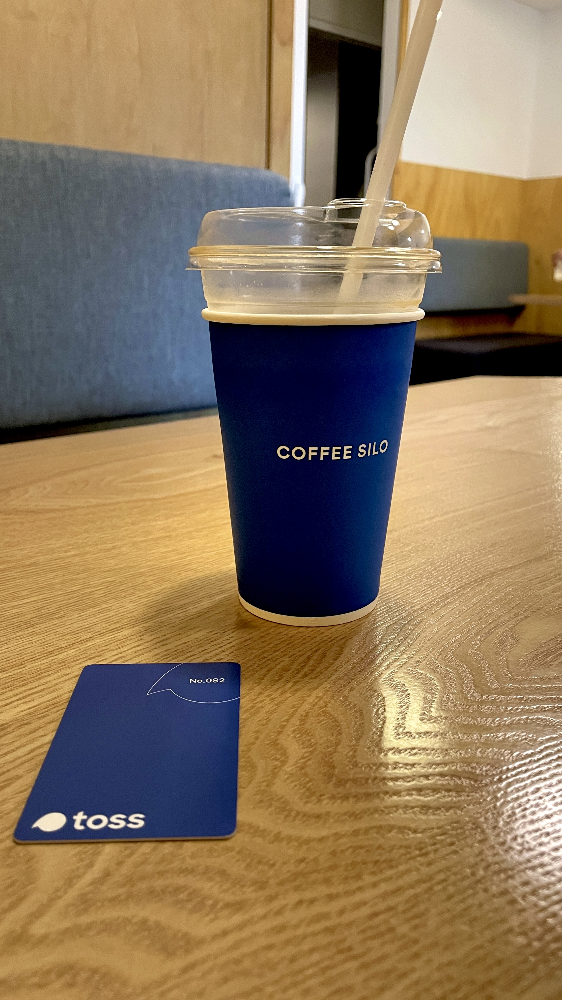
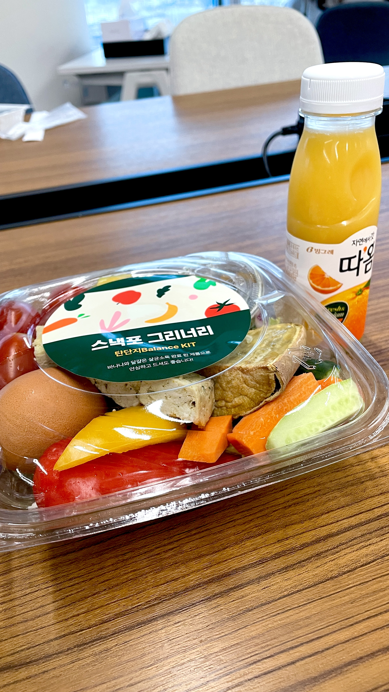
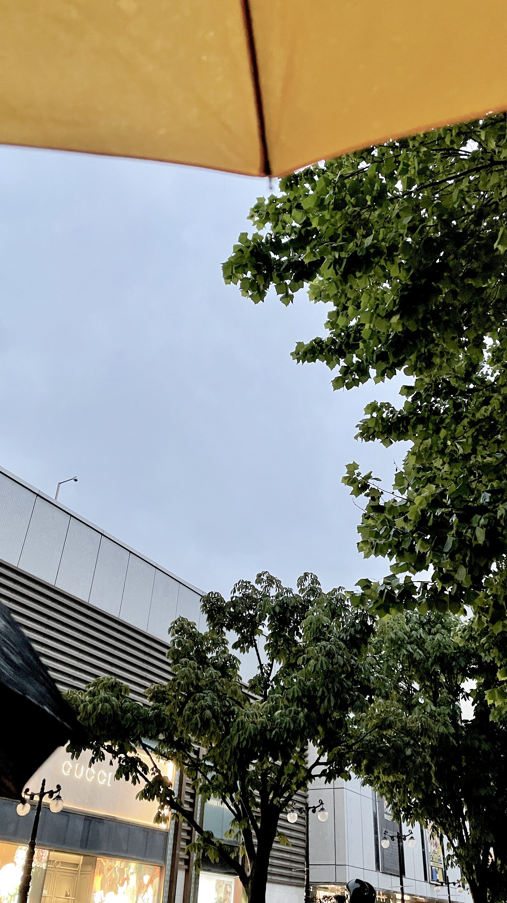

## 첫 출근

### 긴장긴장긴장

동네 유명한 길치인 나는 혹시라도 지각할까봐 1시간 일찍 출발했다.
기다림 속에 처음이라는 경험에 덜덜덜 떨고 있었다.
좋은 일만 생길 거라며 주문을 외우며 스마일을 그렸다. (몇 개나 그린 건지...ㅎ)

### 내 머릿속은 카오스

이날 종일, 말 그대로 정신이 없었다.

토스카드를 받고 내 자리를 안내받고 앉으니 점심시간이었다.

밥을 어떻게 먹은 건지 기억도 잘 안 난다.
노트북을 받고 계정을 부여받고 내 자리를 정돈하고,
맥북 환경 세팅하니까 벌써 퇴근 시간이었다. 하루가 순식간에 사라졌다.

### 토스 사내 카페, 커피 사일로

커피가 진짜 너무너무 맛있다!! 
당분간 다른 카페 커피는 못 마실 거 같다.
매일 디저트 메뉴가 바뀐다고 하는데, 특히나 빵이 진짜 맛있다!
역시나 인기가 많아서 금방 동난다고 한다!

## 첫 PR, 머지되던 그 순간을 잊을 수 없어!

**'2022년 6월 29일 오후 4시 59분'** TDS에 나의 첫 PR이 머지되었다.
좋아하는 앱에 내가 작성한 코드가 적용되었다는 경험에서 오는 감정은 어떤 말로도 표현될 수 없는 것 같다.

기록으로 남기고 싶은 순간이다.

## 첫 출근, 그 후 일주일 동안

사회생활이 처음이라 긴장도 많이 했고 걱정도 많이 했는데,
팀원분들과 이미 근무 중이셨던 다른 Assistant 분들이 편하게 대해줘서 금방 적응할 수 있었다.

일주일 동안 내가 해야 할 일이 뭔지, 업무를 정확히 파악하려고 노력했던 것 같다.

어떻게 해야하는지 먼저 계셨던 Assistant 분들에게도 여쭤보고 담당자님한테도 여쭤보고
물음의 연속 끝에, 그분들의 도움 덕분에 아주 조금은 알 것 같은 기분이 들긴 했다(여전히 아리송하지만..ㅎ)

### 디자인 플랫폼 팀과의 커피쳇

디자인 플랫폼 팀원들과 간단한 커피챗을 했다. 
다들 흔쾌히 뭐든 편하게 물어봐달라고 했다. 커피와 함께해서 그런가 분위기가 훈훈하고 부드러웠다.

### 나의 담당자, 규진님과의 커피쳇

규진님의 섬세한 질문에 감동했다.
지금 하는 일이 적성에 맞는지 살피시고, 이 회사에 있는 동안 하고 싶은 일을 할 수 있게 도와주려고 노력하셨다.
꿈이 뭔지 물어봐 주시고 그 방향으로 가기 위해서 도움이 될 수 있는 태스크를 주셨다.
팀원 각각의 성격을 섬세히 살피는 꼼꼼한 리더라고 생각했다.

처음 출근한 날, 카페에 앉아있는데 어깨 너머로 두 사람의 이야기가 들려왔다.
그 이야기를 듣고, 토스의 팀원들은 서로서로 잘 챙긴다는 느낌을 받았다. 
요즘 작업이 잘 안되는 거 같은데 혹시 힘든 일이 있는 건 아닌지 조심스럽게 여쭤보시고 
그 말에 솔직한 심정을 털어놓는 모습에 이런 좋은 문화를 경험할 기회에 감사했다.

### 금요일, 이번 주 업무를 마무리하면서

팀에 도움이 되는 사람이 되고 싶다는 생각을 강하게 했다.

TDS가 어떻게 시작하고 변해왔는지, 디자이너와 개발자의 효율성을 위해서 어떤 아이디어들이 추가되었는지
그 과정을 알고 나니까 TDS가 더 좋아졌고 나도 기여하고 싶다고 생각했다.

업무 파악을 위해 했던 질문과 일주일 동안의 경험을 토대로, 입사할 때 미리 알면 좋을 거 같은 것들을
구글 Docs 가이드에 정돈했다. 
(+ 나중에 일주일 뒤에 새 어시스턴트 두 분이 오셨는데, 
가이드가 도움이 많이 되었다는 말에 너무 뿌듯했다^^)

지금은 주어진 업무 중에 잘 모르는 부분이 있어 그 부분을 공부하고 있다.
다음 주의 나는 뭘 하고 있을지 기대되면서도 아직은 말랑 콩떡 쪼무래기라는 생각에 더 열심히 해야겠다 싶었다.

좀 더 발전된 내가 되어있기를 또 좀 더 적응한 내가 되어있기를 기대한다.